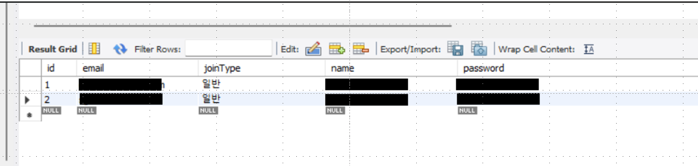
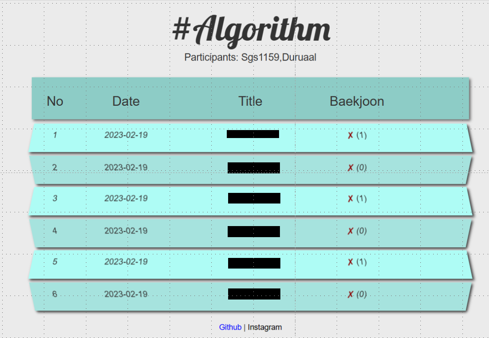

# Cote-User-Computed Alarm
> 설치 방법

1. SBApplication 실행 

2. MySQL client 에서 kknni_tb_usr 테이블에 다음과 같이 입력

   

3. localhost:9040/user/rank 로 보기 > 결과

4. 

# Settings
Default Project Database Port 1366 - MySQL
Web Application Server Port - 9040

# How it works

```bash
|____common          # Project Common
|____config          # Spring Config
|____ctrl            # Controller
|____entity          # DB Table Entity
|____job             # Spring Batch
|____repo            # DB Table Repository
|____service         # Service
|SBApplication.java  # SpringBoot Application Main
```

# Getting started

```bash
# maven build
$ mvn clean package

# servce
$ java -jar target/**.war
```

![image-20230219201501149](README.assets/image-20230219201501149.png